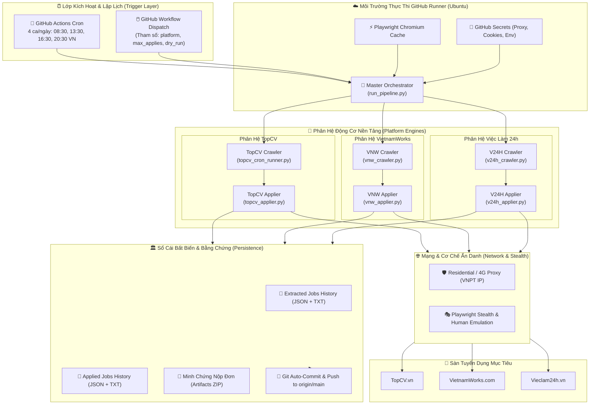
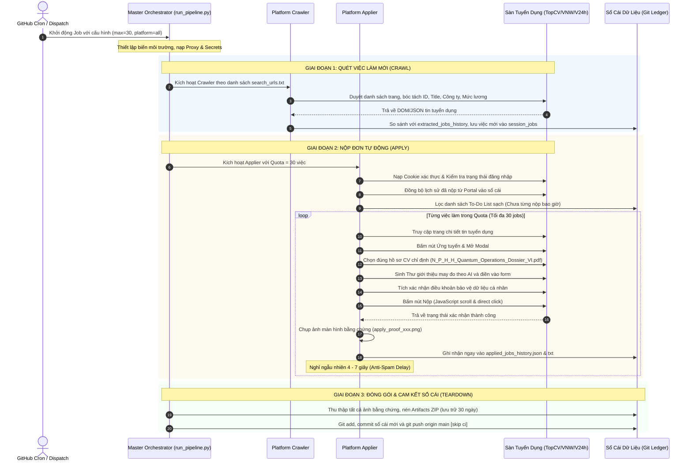
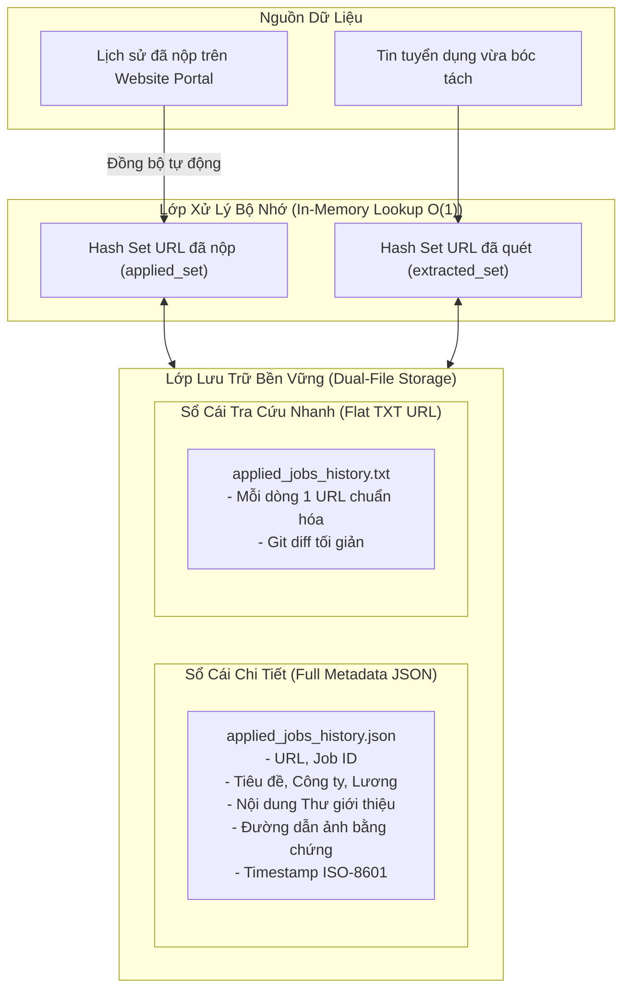
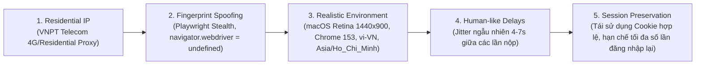
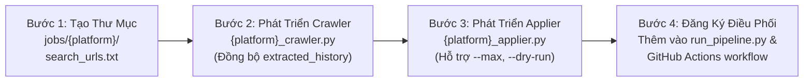

# 🏛️ Kiến Trúc Hệ Thống Tự Động Hóa Tuyển Dụng Đa Nền Tảng (Job4Fun)

## 1. Tổng Quan Hệ Thống (System Overview)

**Job4Fun** là hệ thống tự động hóa toàn diện quy trình tìm kiếm, sàng lọc và ứng tuyển việc làm (Crawler & Auto-Applier) trên các nền tảng tuyển dụng hàng đầu tại Việt Nam (**TopCV**, **VietnamWorks**, **Vieclam24h**, và mở rộng cho **CareerViet**).

Hệ thống được thiết kế theo mô hình **Zero-Infrastructure / Serverless Automation**, vận hành hoàn toàn trên **GitHub Actions CI/CD** kết hợp công nghệ điều khiển trình duyệt **Playwright (Headless Chromium)**, mạng xoay vòng **Residential Proxy**, và cơ chế **Stealth Anti-Detection** nhằm đảm bảo khả năng bypass các lớp bảo vệ WAF (Cloudflare, Nginx, reCAPTCHA).



---

## 2. Chiến Lược Vận Hành: "Chia Nhỏ Ca, Nộp Thần Tốc" (Cadence Strategy)

Thay vì chạy một mẻ lớn kéo dài (100+ việc làm/lần) dễ gây quá tải, dính bẫy Anti-Spam hoặc chạm trần Timeout 120 phút của GitHub Actions, kiến trúc áp dụng chiến lược **High-Cadence, Short-Batch Execution**:

| Thông Số | Cấu Hình Cũ (3 Ca Lớn) | Cấu Hình Mới (4 Ca Tối Ưu) |
| :--- | :--- | :--- |
| **Số ca mỗi ngày** | 3 ca (08:30, 13:30, 16:30) | **4 ca (08:30, 13:30, 16:30, 20:30)** |
| **Biểu thức Cron** | `30 1,6,9 * * 1-5` | `30 1,6,9,13 * * 1-5` (UTC) |
| **Hạn mức mỗi sàn/ca** | 35 – 100 việc làm | **30 việc làm / sàn / ca** |
| **Thời gian chạy mỗi ca** | ~90 – 120 phút (dễ timeout) | **~25 – 30 phút** (an toàn tuyệt đối) |
| **Tổng sản lượng nộp** | ~100 – 150 đơn/ngày | **~360 đơn/ngày** (90 đơn/ca x 4 ca) |
| **Nguy cơ Bot Detection**| Trung bình – Cao | **Thấp nhất** (Hành vi chia đều tự nhiên) |
| **Lợi thế ứng viên** | Đơn nộp dồn một đợt | **First-Mover**: Luôn xuất hiện trong top đầu hồ sơ nhà tuyển dụng xem vào đầu giờ sáng, đầu giờ chiều, cuối giờ làm việc và buổi tối |

---

## 3. Cấu Trúc Thành Phần & Monorepo Layout

Toàn bộ mã nguồn và dữ liệu lịch sử được tổ chức trong cấu trúc Monorepo độc lập nhưng có khả năng chia sẻ thư viện dùng chung:

```text
jobs/
├── .github/
│   └── workflows/
│       └── multi_platform_pipeline.yml  # GitHub Actions Workflow điều khiển 4 ca & dispatch
│
├── shared/                               # Thư viện dùng chung đa nền tảng
│   ├── proxy_utils.py                    # Parser định dạng proxy chuỗi (host:port:user:pass)
│   └── text_utils.py                     # Chuẩn hóa Unicode, xử lý tiếng Việt không dấu
│
├── topcv/                                # PHÂN HỆ TOPCV
│   ├── topcv_cron_runner.py              # Crawler quét tin tuyển dụng TopCV theo từ khóa
│   ├── topcv_applier.py                  # Applier Playwright nộp đơn tự động qua modal TopCV
│   ├── search_urls.txt                   # Danh mục URL mục tiêu (Hà Nội, Giám đốc, Trưởng phòng)
│   ├── extracted_jobs_history.json       # Sổ cái toàn bộ việc làm TopCV đã quét
│   ├── extracted_jobs_history.txt        # Danh sách URL phẳng phục vụ tra cứu O(1)
│   ├── applied_jobs_history.json         # Sổ cái chi tiết các đơn đã nộp (thời gian, thư, ảnh)
│   ├── applied_jobs_history.txt          # Danh sách URL đã nộp ngăn trùng lặp
│   ├── session_extracted_jobs.txt        # Việc làm mới phát hiện trong ca hiện tại
│   └── errors/                           # Lưu vết lỗi ngoại lệ và ảnh chụp màn hình DOM
│
├── vietnamworks/                         # PHÂN HỆ VIETNAMWORKS
│   ├── vnw_crawler.py                    # Crawler quét danh sách việc làm VietnamWorks
│   ├── vnw_applier.py                    # Applier nộp đơn tự động qua giao diện ứng tuyển VNW
│   ├── search_urls.txt                   # URL tìm kiếm VietnamWorks (l=70 Quốc tế, Hà Nội)
│   ├── extracted_jobs_history.json       # Sổ cái việc làm đã quét VietnamWorks
│   ├── applied_jobs_history.json         # Sổ cái đã nộp VietnamWorks
│   ├── applied_jobs_history.txt          # URL đã nộp VietnamWorks
│   └── errors/                           # Ảnh chụp và chi tiết lỗi
│
├── vieclam24h/                           # PHÂN HỆ VIỆC LÀM 24H
│   ├── v24h_crawler.py                   # Crawler bóc tách phân trang Vieclam24h
│   ├── v24h_applier.py                   # Applier xử lý React hydration, unverified jobs, split DOM
│   ├── search_urls.txt                   # URL mục tiêu (Hà Nội p73, Giám đốc KD, Trưởng phòng KD)
│   ├── extracted_jobs_history.json       # Sổ cái việc làm đã quét Vieclam24h
│   ├── applied_jobs_history.json         # Sổ cái đơn đã nộp Vieclam24h
│   ├── applied_jobs_history.txt          # URL đã nộp Vieclam24h
│   └── errors/                           # Ảnh chụp và JSON lỗi
│
├── careerviet/                           # PHÂN HỆ CAREERVIET (Sẵn sàng mở rộng)
├── run_pipeline.py                       # Master Orchestrator điều phối tuần tự 3 sàn
├── requirements.txt                      # Dependencies: playwright, playwright-stealth...
├── ARCHITECTURE.md                       # Tài liệu kiến trúc hệ thống
└── README.md                             # Hướng dẫn cài đặt & vận hành
```

---

## 4. Quy Trình Vận Hành Của Từng Ca (Shift Execution Lifecycle)

Mỗi ca làm việc diễn ra theo một chuỗi sự kiện được điều phối chặt chẽ:



---

## 5. Kiến Trúc Chi Tiết Các Phân Hệ (Subsystem Deep-Dive)

### 5.1. Master Orchestrator (`run_pipeline.py`)
* **Vai trò**: Đóng vai trò là tổng công trình sư điều phối, bảo vệ luồng thực thi không bị đứt đoạn.
* **Nguyên tắc "Fail-Safe Isolation"**: Lỗi xảy ra ở một sàn (ví dụ: sàn tạm bảo trì hoặc đổi giao diện) được đóng gói trong khối `try...except`, ghi log chi tiết và tự động chuyển giao quyền thực thi sang sàn tiếp theo mà không làm sập toàn bộ workflow.
* **Hỗ trợ tham số linh hoạt**:
  * `--platform all | topcv | vietnamworks | vieclam24h`
  * `--max 30` (hoặc bất kỳ hạn mức tùy biến)
  * `--dry-run` (chế độ kiểm thử an toàn không bấm nộp thật).

### 5.2. Phân Hệ TopCV (`topcv/`)
* **Cơ chế xác thực**: Nạp session cookies (`topcv_cookies.json`). Nếu session hết hạn, kích hoạt luồng fallback đăng nhập biểu mẫu tự động với mật khẩu mã hóa từ secret.
* **May đo Thư Giới Thiệu (Tailored Cover Letter Engine)**:
  Phân tích ngữ nghĩa tiêu đề và mô tả công việc (Job Description) bằng thuật toán regex từ khóa để sinh thư giới thiệu phù hợp với 4 nhóm chuyên môn:
  1. *E-commerce / Sàn TMĐT*: Quản trị kênh Shopee, TikTok Shop, B2C/B2B.
  2. *Thương Mại Quốc Tế / Xuất Nhập Khẩu*: Phát triển đối tác chiến lược xuyên biên giới, đàm phán hợp đồng quốc tế.
  3. *Lãnh Đạo / Quản Lý Doanh Nghiệp*: Hoạch định chiến lược kinh doanh, tối ưu hóa quy trình, tự động hóa quản lý khách hàng.
  4. *Phát Triển Khách Hàng Doanh Nghiệp (B2B / KAM)*: Mở rộng tệp khách hàng đối tác lớn, quản trị doanh thu.
* **Khắc phục triệt để lỗi Modal Submit Button**:
  Sử dụng cơ chế `page.evaluate()` trực tiếp trên DOM của modal:
  `modal.querySelector('#btn-apply, button[type=submit].btn-theme').scrollIntoView(); submitBtn.click();`
  Loại bỏ hoàn toàn lỗi chờ hiển thị của Playwright khi nút nộp bị che khuất hoặc nằm ngoài khung nhìn.

### 5.3. Phân Hệ VietnamWorks (`vietnamworks/`)
* **Kiến trúc đồng bộ (Sync Playwright)**: Tối ưu cho mô hình đồng bộ, kiểm soát chặt chẽ từng thao tác tương tác trang.
* **Xử lý bảng câu hỏi khảo sát (Custom Questionnaire)**:
  Nhiều tin tuyển dụng của VietnamWorks yêu cầu trả lời thêm câu hỏi phụ (năm kinh nghiệm, mức lương mong muốn, thời gian có thể bắt đầu làm việc). Applier tự động nhận diện các trường input/radio phụ và điền câu trả lời chuẩn xác.
* **Phát hiện hạn mức nộp trong ngày (Daily Limit Detection)**:
  VietnamWorks áp dụng trần số lượng nộp hồ sơ mỗi ngày cho tài khoản ứng viên. Khi phát hiện thông báo hạn mức (`DAILY_LIMIT_REACHED`), applier lập tức dừng ca nộp của VietnamWorks một cách an toàn, lưu log và nhường quyền cho sàn tiếp theo mà không sinh lỗi giả.

### 5.4. Phân Hệ Việc Làm 24h (`vieclam24h/`)
* **Xử lý hiện tượng React Client-side Hydration**:
  Nút "Ứng tuyển ngay" trên Vieclam24h render từ Server-Side nhưng cần thời gian để React đính kèm Event Listener. Applier cài đặt vòng lặp retry 3 lần kèm cuộn trang và delay 2s để đảm bảo click kích hoạt mở modal thành công.
* **Xử lý thông báo việc làm chờ kiểm duyệt (Unverified Jobs Modal)**:
  Đối với các tin tuyển dụng chưa qua kiểm duyệt, hệ thống tự động nhận diện modal cảnh báo và bấm `Tiếp tục nộp` trước khi tiến vào giao diện nộp CV.
* **Xử lý tách thẻ DOM (Split-Span Matching)**:
  Tên file CV bị chia nhỏ thành nhiều thẻ `<span>` con (`<span>N_P_H_H_Quantum_Operations_</span>` và `<span>Dossier_VI.pdf</span>`). Bộ chọn Playwright được thiết kế chọn lọc cấp cha:
  `[data-test-id="unified-apply__cv-item"]:has-text("Quantum_Operations")` để luôn chọn đúng CV mong muốn.

---

## 6. Kiến Trúc Dữ Liệu & Sổ Cái Bất Biến (Data Persistence Architecture)

Hệ thống tuân thủ nguyên tắc **Zero Data Loss** và **Không Bao Giờ Nộp Trùng Đơn**:



### Quy tắc chuẩn hóa URL (URL Normalization)
Mọi URL trước khi đối chiếu hoặc lưu vào sổ cái đều được loại bỏ tham số truy vấn (`?query=...`) và anchor (`#...`):
`clean_url = raw_url.split('?')[0].split('#')[0]`
Đảm bảo cùng một tin tuyển dụng dù truy cập từ nguồn tìm kiếm nào cũng có định danh duy nhất.

---

## 7. Kiến Trúc Ẩn Danh & Vượt Tường Lửa (Anti-Detection Engine)



1. **IP Dân Cư Sạch (Residential Proxy)**: Sử dụng IP dân cư nhà mạng VNPT (`103.121.89.32`), không bị định danh là IP Datacycle/Hosting của GitHub Runner.
2. **Ẩn Danh Thuộc Tính Trình Duyệt (Playwright Stealth)**:
   - Ghi đè `navigator.webdriver = false`.
   - Giả lập WebGL Vendor, Canvas fingerprinting, AudioContext, Battery API.
   - Giả lập bộ plugin chuẩn của Google Chrome trên macOS.
3. **Môi Trường Trực Quan Hoàn Thiện**:
   - Viewport chuẩn Retina `1440x900`.
   - Timezone `Asia/Ho_Chi_Minh` và Locale `vi-VN`.
4. **Nhịp Thở Con Người (Human-like Jitter)**:
   - Thời gian chờ giữa các thao tác cuộn trang và click ngẫu nhiên từ 1.5s đến 3s.
   - Thời gian chờ giữa các lượt nộp đơn ngẫu nhiên từ 4s đến 7s.
5. **Bảo Tồn Session**:
   - Lưu trữ và tái nạp Cookie sau mỗi ca chạy để duy trì trạng thái đăng nhập liên tục, tránh việc đăng nhập nhiều lần làm kích hoạt cảnh báo bảo mật từ hệ thống.

---

## 8. Ma Trận Xử Lý Sự Cố & Tự Phục Hồi (Fault Tolerance Matrix)

| Kịch Bản Sự Cố | Triệu Chứng Nhận Diện | Cơ Chế Tự Động Xử Lý |
| :--- | :--- | :--- |
| **Tin tuyển dụng hết hạn / đã đóng** | Không tìm thấy nút ứng tuyển (`hasApplyBtn = False`) | Ghi nhận lỗi vào `errors/error_<id>.json`, chụp ảnh màn hình lưu vết, tự động bỏ qua và chuyển sang tin tiếp theo. Không dừng chương trình. |
| **Đã từng ứng tuyển trước đó** | Giao diện hiện "Đã ứng tuyển" | Tự động đồng bộ URL vào sổ cái `applied_jobs_history` và bỏ qua ngay lập tức. |
| **Tin việc làm chưa qua kiểm duyệt** | Xuất hiện popup cảnh báo rủi ro | Nhận diện selector popup, tự động nhấn `Tiếp tục nộp` và mở tiếp form nộp CV. |
| **Nút Nộp bị che khuất trong Modal** | Playwright báo `element is not visible` | Dùng JavaScript DOM `scrollIntoView()` và `submitBtn.click()`, kích hoạt sự kiện click trực tiếp trên phần tử. |
| **Hết hạn mức nộp trong ngày** | Modal báo *"Bạn đã dùng hết lượt nộp hôm nay"* | Bắt cờ `DAILY_LIMIT_REACHED`, chụp ảnh bằng chứng, kết thúc ca nộp của sàn đó một cách an toàn và nhường quyền cho sàn tiếp theo. |
| **Runner bị ngắt giữa chừng** | Runner gặp sự cố hệ thống | Bước `if: always()` trên GitHub Actions luôn được đảm bảo kích hoạt: commit và đẩy toàn bộ dữ liệu đã ghi nhận lên Git trước khi container bị hủy. |

---

## 9. Hướng Dẫn Tích Hợp Thêm Nền Tảng Mới (Extensibility Guide)

Để mở rộng hệ thống sang các nền tảng mới (như **CareerViet**, **Anphabe**, **Glints**), chỉ cần thực hiện theo chuẩn thiết kế 4 bước:



1. **Chuẩn hóa giao diện CLI của Applier**:
   Mọi applier phải chấp nhận các cờ dòng lệnh:
   - `--max <số lượng việc>` (Mặc định: 30)
   - `--dry-run` (Chế độ chạy thử)
2. **Tuân thủ chuẩn Sổ Cái**:
   - `extracted_jobs_history.json` & `.txt`
   - `applied_jobs_history.json` & `.txt`
   - Lưu ảnh chụp bằng chứng với tiền tố `apply_proof_{platform}_{id}.png`.
3. **Đăng ký vào `run_pipeline.py`**:
   Thêm khối gọi phân hệ với hàm `run_step()` để thừa hưởng cơ chế quản lý timeout, logging và error boundary dùng chung.
